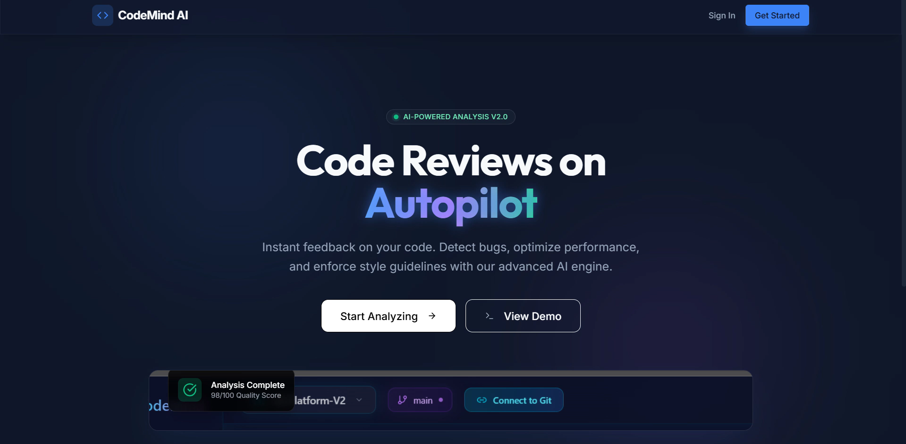

# 🚀 AI-Driven Code Reviewer

An intelligent AI-powered platform that automatically analyzes student code and provides professional review, optimization suggestions, and quality score.

---

# 🌐 Live Deployment

🔗 Live Demo:

[https://code-mind-reviewer--rahulsecret2004.replit.app/](https://code-mind-reviewer--rahulsecret2004.replit.app)

---

## 🎥 Project Demo

Click the image above to watch the full project demonstration

---

🛠️ Installation & Setup Guide

Follow these steps to run the AI-Driven Code Reviewer locally on your system.

🔹 Step 1: Clone the Repository

git clone https://github.com/SIBANSHAMISHRA/11_Development-of-AI-Driven-Code-Reviewer.git

cd 11_Development-of-AI-Driven-Code-Reviewer

🔹 Step 2: Navigate to Project Files

cd "Project Files"

🔹 Step 3: Backend Setup (FastAPI)

cd backend

pip install -r requirements.txt

python main.py

✅ Backend will run on:

http://localhost:8000

🔹 Step 4: Frontend Setup (React + Vite)

Open new terminal:

cd "Project Files/frontend"

npm install

npm run dev

✅ Frontend will run on:

http://localhost:5173

⚙️ Requirements

Python 3.10+

Node.js 18+

Git

npm

---

# 📌 Project Overview

Manual code review is:

• Slow  
• Inconsistent  
• Not scalable  

This project solves this using:

• Artificial Intelligence  
• AST Analysis  
• Automated Review Engine  

---

# 🧠 Key Features

✔ AI Code Review using GPT  
✔ Bug Detection  
✔ Optimization Suggestions  
✔ Security Analysis  
✔ Complexity Analysis  
✔ Quality Score Generation  
✔ Review History Storage  

---

# 🧱 System Architecture

Flow:

User Code Input  
↓  
React Frontend  
↓  
FastAPI Backend  
↓  
AST Parser  
↓  
OpenAI GPT API  
↓  
Review Generator  
↓  
Database Storage  
↓  
Results Display  

---

# 💻 Tech Stack 

Frontend:

• React  
• TypeScript  
• TailwindCSS  

Backend:

• FastAPI  
• Python  

Database:

• PostgreSQL (NeonDB)

AI:

• OpenAI GPT-4 API  

Deployment:

• Replit  

Version Control:

• GitHub  

---

# 🤖 AI Integration

Uses:

OpenAI GPT API for:

• Code Review  
• Optimization  
• Suggestions  

AST Parser for:

• Structure Analysis  
• Complexity  

---

# 📊 Features Demonstrated

User can:

✔ Write code  
✔ Click Review  
✔ Get AI Feedback  
✔ View optimization  
✔ View score  

---
